# 🔮 QueryCraft
> *Transform natural language into SQL magic* ✨

<p align="center">
  
</p>

<p align="center">
  <strong>🚀 The intelligent SQL query generator that speaks your language</strong>
</p>

<p align="center">
  Ask questions in plain English → Get SQL queries → Download results
</p>

---

## 🌟 What Makes QueryCraft Special?

QueryCraft bridges the gap between human curiosity and database insights. No more struggling with complex SQL syntax - just ask your questions naturally and watch the magic happen!

```
💬 "Show me all customers from California who ordered more than $500 worth of products"
     ↓
🔮 QueryCraft processes your question
     ↓
📊 SELECT c.name, c.location, SUM(o.amount) as total...
     ↓
📈 Beautiful results table with export options
```

## ✨ Key Features

| Feature | Description |
|---------|-------------|
| 🧠 **Smart AI Processing** | Powered by advanced language models to understand context |
| ⚡ **Instant Results** | Real-time query generation and execution |
| 📊 **Beautiful Tables** | Clean, responsive data visualization |
| 📥 **Export Options** | Download as CSV or Excel with one click |
| 🔐 **No Registration** | Start querying immediately - no sign-up required |
| 📱 **Mobile Friendly** | Works perfectly on all devices |

## 🎮 How It Works

```mermaid
graph LR
    A[🗣️ Ask Question] --> B[🧠 AI Processing]
    B --> C[⚡ SQL Generation]
    C --> D[🔍 Database Query]
    D --> E[📊 Results Display]
    E --> F[📥 Export Data]
```



## 💭 Example Queries You Can Ask

```sql
💬 "Show me top 5 customers by total orders"
💬 "List all products that haven't been sold this month"
💬 "Find employees with salary above average"
💬 "Which regions have the highest sales growth?"
💬 "Show me customers who ordered multiple times"
```

## 🛠️ Tech Stack

<p align="center">
  
  
  
  
  
</p>

**Frontend:** React.js,HTML,CSS  
**Backend:** Flask     
**AI:** Advanced language model processing  
**Export:** CSV & Excel generation  
**Styling:** Custom CSS with gradient themes  

## 🚀 Quick Start

### Prerequisites
- Node.js (v14+)
- Modern web browser
- Database connection details

### Installation

```bash
# 📦 Clone the repository
git clone https://github.com/gezhilarasu/SQL-QUERY-GENERATOR.git
cd querycraft

# 📋 Install dependencies
npm install

# 🎯 Start the development server
npm start

# 🌐 Open http://localhost:3000
```

### 🔧 Environment Setup

Create a `.env` file in your project root:

```env
REACT_APP_API_URL=your_backend_url
REACT_APP_AI_MODEL=your_ai_model_endpoint
```


## 🎯 Usage Examples

### Basic Query
```javascript
// Ask a simple question
"Show all users from New York"

// Generated SQL
SELECT * FROM users WHERE city = 'New York';
```

## 📊 Features in Detail

### 🔮 AI-Powered Query Generation
- Natural language understanding
- Context-aware SQL generation
- Smart table relationship detection
- Error handling and suggestions

### 📈 Data Visualization
- Responsive table design
- Sortable columns
- Pagination for large datasets
- Clean, modern interface

### 📥 Export Capabilities
- CSV format for spreadsheet compatibility
- Excel format with formatting
- Custom filename options
- Batch export support


### Docker
```dockerfile
FROM node:16-alpine
WORKDIR /app
COPY package*.json ./
RUN npm install
COPY . .
RUN npm run build
EXPOSE 3000
CMD ["npm", "start"]
```

## 🤝 Contributing

We love contributions! Here's how you can help:

1. 🍴 Fork the repository
2. 🌿 Create a feature branch (`git checkout -b feature/amazing-feature`)
3. 💎 Commit your changes (`git commit -m 'Add amazing feature'`)
4. 🚀 Push to the branch (`git push origin feature/amazing-feature`)
5. 🎯 Open a Pull Request

## 📈 Roadmap

- [ ] 🔄 Query history and favorites
- [ ] 🔗 Multiple database support
- [ ] 📊 Data visualization charts
- [ ] 🤖 Query optimization suggestions

## 📄 License

This project is licensed under the MIT License - see the [LICENSE](LICENSE) file for details.

## 👨‍💻 Author

**Ezhilarasu G**  
🎓 B.Tech | Artificial Intelligence and Machine Learning  
💡 Passionate about making data accessible to everyone  

<p align="center">
  <a href="https://github.com/gezhilarasu">
    
  </a>
  <a href="https://linkedin.com/in/gezhilarasu">
    
  </a>
  <a href="mailto:your.gezhilarasu24@gail.com">
    
  </a>
</p>

---

<p align="center">
  <strong>⭐ Star this repo if QueryCraft helped you! ⭐</strong>
</p>

<p align="center">
  Made with ❤️ and ☕ by developers who believe data should be accessible to everyone
</p>